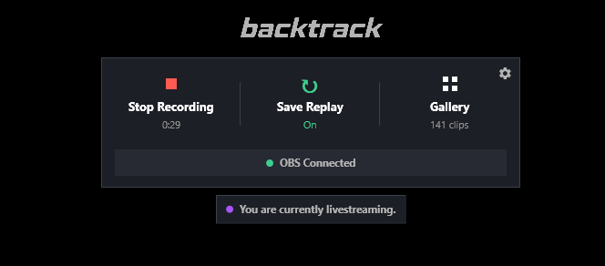
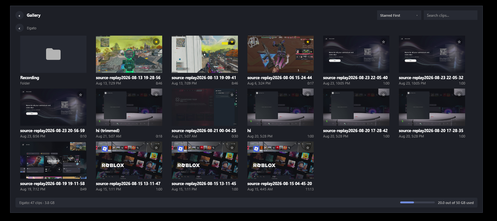
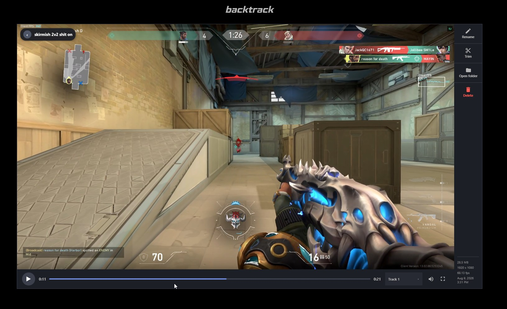
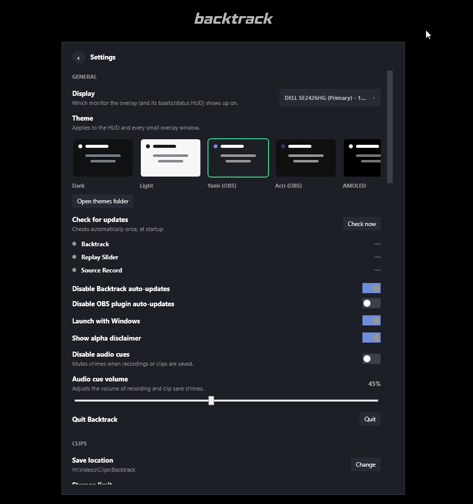

# Backtrack

A hotkey-summoned overlay HUD for OBS - record, save your replay buffer, and
browse your clips without alt-tabbing out of your game.

Backtrack talks to OBS entirely over **obs-websocket**, so it never touches
your scene collection or settings directly. It's a companion, not a plugin -
it sits on top of whatever OBS setup you already have (including a global
replay buffer, or per-source buffers via [obs-source-record](https://github.com/ilyambr/obs-source-record)
and [obs-replay-slider](https://github.com/ilyambr/obs-replay-slider), if
you're running those too).

---

## Screenshots

| Idle | Gallery | Player | Settings |
|---|---|---|---|
|  |  |  |  |

---

## 1. Prerequisites

- **Windows 10/11** - Backtrack is a WPF app, Windows-only for now (see
  [VERSIONING.md](VERSIONING.md) for the plan if that ever changes).
- **OBS Studio** with its built-in **obs-websocket** server turned on
  (`Tools > WebSocket Server Settings`).

---

## 2. Installation

Download the latest installer from [Releases](https://github.com/ilyambr/backtrack/releases)
and run it. Backtrack checks for updates automatically once an hour and can
install them itself.

To build from source instead:

```bash
dotnet build -c Release
```

---

## 3. Usage

Press **Ctrl+Alt+G** (configurable in Settings) to summon the HUD over
whatever you're doing - game, browser, doesn't matter, it floats on top.
From there:

- **Record** - start/stop recording a source, or the whole scene.
- **Save Replay** - flush a running replay buffer straight to disk.
- **Gallery** - browse saved clips by folder, rename/trim/delete them, or
  open one in the built-in player (fullscreen included).
- **Settings** - gear icon, top-left of the screen.

Press **Escape** to back out of whatever you're doing, or to close the HUD
entirely.

---

## 4. Features

- **Fullscreen clip player** - VLC-backed playback with trim, rename, and a
  true edge-to-edge fullscreen mode (overlay transport bar, not a docked one).
- **Themes** - Dark, Light, Yami (matches OBS's own default theme), and AMOLED.
- **RAM disk support** - mount an ImDisk virtual drive for OBS to write its
  replay buffer to, for lower-latency saves.
- **Remote OBS** - point Backtrack at OBS running on a *different* PC (e.g. a
  separate streaming/capture box) instead of the one it's running on.
- **Clip sharing** - pull clips from another PC's Backtrack instance on the
  same network (or over Tailscale) into your own Gallery.
- **Per-source buffers** - if you're running obs-source-record and/or
  obs-replay-slider, Backtrack lists and saves each individually.

---

## 5. Known limitations

- **Per-source status needs obs-replay-slider installed too.** obs-source-record
  has no way to report "am I currently recording/buffering" on its own -- Backtrack
  gets that status exclusively from obs-replay-slider's dock. If you're running
  obs-source-record by itself, its filters work fine inside OBS, but Backtrack
  won't show them as active in the HUD.
- **Clip sharing needs both PCs reachable and awake.** A remote Gallery action
  (delete, rename, download) times out after 15 seconds if the paired PC doesn't
  respond -- expect that error if it's asleep, offline, or unreachable over
  whatever network path you paired it on.

---

## 6. Related projects

- [obs-source-record](https://github.com/ilyambr/obs-source-record) - OBS
  plugin, records/replays individual sources via a filter.
- [obs-replay-slider](https://github.com/ilyambr/obs-replay-slider) - OBS
  plugin, a dock for per-source replay buffers.

---

## Issues

Backtrack is alpha software - expect rough edges. Report bugs at
[github.com/ilyambr/backtrack/issues](https://github.com/ilyambr/backtrack/issues).
